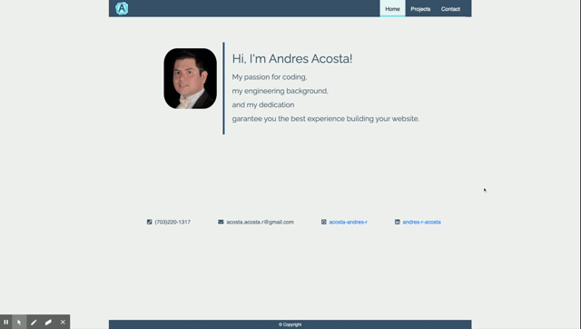

<h1 align="center"> PORTFOLIO </h1> 

 

  

  
### Description
This is my portfolio that contains my work as Full Stack Web Developer. Clients are able to contact me throughout the website. Technologies used: React, Express, and Node.

### Table of Contents

  * [Installation](#installation)
  * [Usage](#usage)
  * [Credits](#credits)
  * [License](#license)
  * [Contributing](#contributing)
  * [Questions](#questions)

### Installation
This app is completely deployed using Heroku: [Deployed Link](https://andres-portfolio-react.herokuapp.com)

### Usage

Demo

### License

Copyright (c) Andres Acosta. All rights reserved.
Licensed under the [MIT license](LICENSE).

### Credits

👤 **Andres Acosta** (author): [GitHub](https://github.com/acosta-andres-r)

### Contributing
Please note that this project is released with a [Contributor Code of Conduct](CODE_OF_CONDUCT.md). By participating in this project you agree to abide by its terms.

### Questions
 For more information, additional questions or comments, please contact [Andres Acosta](https://github.com/acosta-andres-r).

